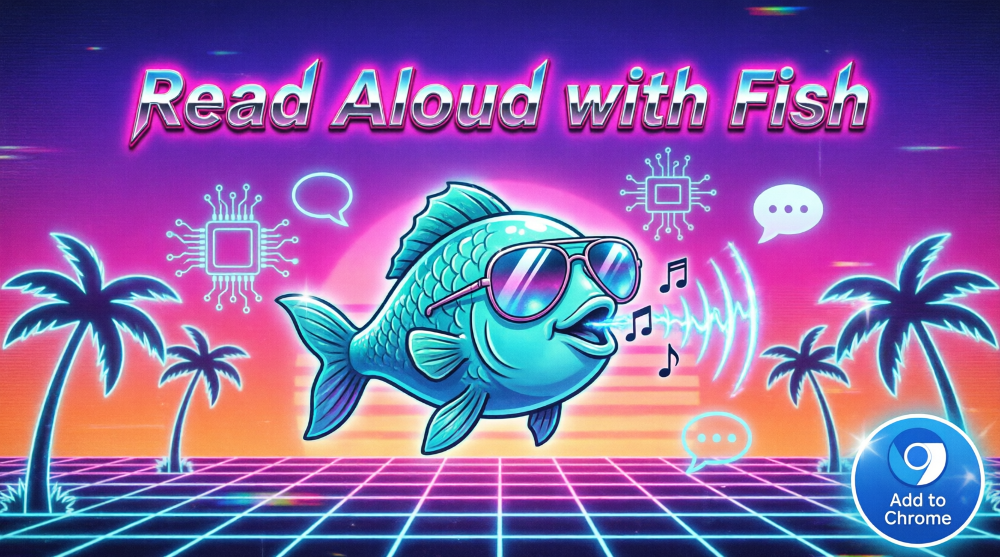

  

# Read Aloud (Fish Audio)

**English** · [فارسی](#خواندن-با-صدای-بلند-fish-audio)

A Chrome extension that reads any highlighted text on a web page out loud, using [Fish Audio](https://fish.audio)'s text-to-speech API. Highlight text, then either open the extension popup or right-click and choose **"Read Aloud"** — no page reload, no copy-pasting into another app.

This extension is **not published on the Chrome Web Store**. It's distributed as source only and must be loaded manually ("unpacked") into Chrome. That's intentional — see [Installation](#installation-load-unpacked--no-chrome-web-store-needed) below.

## Quick links

- [Installation (Load Unpacked)](#installation-load-unpacked--no-chrome-web-store-needed)
  - [Setting your API key](#setting-your-api-key)
  - [Using it](#using-it)
  - [Updating](#updating)
- [Why no Chrome Web Store listing?](#why-no-chrome-web-store-listing)
- [Permissions used](#permissions-used)

## Features

- 🔊 Right-click any selected text → **Read Aloud** to hear it immediately
- 🖱️ Or open the toolbar popup to play / pause / stop the current selection
- 🔑 Bring your own Fish Audio API key (stored locally in your browser only)
- No data sent anywhere except `api.fish.audio` for the TTS request itself

## How it works

- `background.js` registers the right-click context menu and creates a hidden **offscreen document** (`offscreen.html` / `offscreen.js`) to actually play the audio, since Chrome's Manifest V3 background service workers can't play audio directly.
- `popup.html` / `popup.js` grab the current page selection via `chrome.scripting` and give you play/pause/stop controls.
- `options.html` / `options.js` store your Fish Audio API key in `chrome.storage.local`.
- Your API key and the selected text are sent **only** to `https://api.fish.audio/v1/tts` to generate speech audio.

## Installation (Load Unpacked — no Chrome Web Store needed)

Since this extension isn't published to the Chrome Web Store, you load it directly from source in Developer Mode. This works in Chrome, Brave, Edge, and other Chromium-based browsers.

1. **Download or clone this project** to a folder on your computer.
2. Open your browser and go to the extensions page:
   - Chrome: `chrome://extensions`
   - Edge: `edge://extensions`
   - Brave: `brave://extensions`
3. Turn on **Developer mode** (toggle, usually top-right of the page).
4. Click **"Load unpacked"**.
5. Select the project folder (the one containing `manifest.json`).
6. The **Read Aloud** icon will appear in your toolbar. Pin it if you'd like it always visible.

### Setting your API key

1. Click the extension icon, then **"SET API KEY"** at the bottom of the popup (or right-click the icon → **Options**).
2. Get an API key from your [Fish Audio](https://fish.audio) account.
3. Paste it in and click **SAVE**. It's stored locally in your browser (`chrome.storage.local`) and is never sent anywhere except `api.fish.audio`.

### Using it

- **Right-click menu:** Select text on any page → right-click → **"READ ALOUD: '...'"**. It starts speaking right away. To stop, right-click again → **"STOP READING ALOUD"**.
- **Popup:** Select text → click the toolbar icon → **PLAY** / **PAUSE** / **STOP**.

### Updating

Since it's not on the Web Store, updates don't happen automatically. To update: pull/download the latest files into the same folder, then go back to `chrome://extensions` and click the refresh icon on the Read Aloud card (or remove it and load unpacked again).

## Why no Chrome Web Store listing?

This is a personal/self-hosted tool, not intended for public distribution. Loading it unpacked keeps it fully under your control — no store review process, no auto-updates you didn't approve, and no third-party hosting of your extension code.

## Permissions used

| Permission | Why |
|---|---|
| `activeTab` / `scripting` | Read the text you've highlighted on the current page |
| `storage` | Save your Fish Audio API key locally |
| `contextMenus` | Add the "Read Aloud" right-click menu item |
| `offscreen` | Play the generated audio from the background script |
| `host_permissions: api.fish.audio` | Send text to Fish Audio's TTS API and receive audio back |

---

# خواندن با صدای بلند (Fish Audio)

[English](#read-aloud-fish-audio) · **فارسی**

یک افزونه‌ی کروم که هر متنی را که روی صفحه‌ی وب انتخاب (هایلایت) کنید، با استفاده از سرویس تبدیل متن به گفتار [Fish Audio](https://fish.audio) با صدای بلند می‌خواند. کافیست متن را انتخاب کنید و سپس یا از پاپ‌آپ افزونه استفاده کنید یا روی متن راست‌کلیک کرده و گزینه‌ی **«Read Aloud»** را بزنید — بدون رفرش صفحه و بدون کپی‌پیست در برنامه‌ای دیگر.

این افزونه **در فروشگاه کروم منتشر نشده است**. فقط به‌صورت کد منبع ارائه می‌شود و باید به‌صورت دستی («Unpacked») در کروم بارگذاری شود. این کار عمدی است — به بخش [نصب](#نصب-بارگذاری-unpacked--بدون-نیاز-به-فروشگاه-کروم) نگاه کنید.

## پیوندهای سریع

- [نصب (بارگذاری Unpacked)](#نصب-بارگذاری-unpacked--بدون-نیاز-به-فروشگاه-کروم)
  - [تنظیم کلید API](#تنظیم-کلید-api)
  - [نحوه‌ی استفاده](#نحوهی-استفاده)
  - [به‌روزرسانی](#بهروزرسانی)
- [چرا در فروشگاه کروم منتشر نشده؟](#چرا-در-فروشگاه-کروم-منتشر-نشده)
- [دسترسی‌های استفاده‌شده](#دسترسیهای-استفادهشده)

## امکانات

- 🔊 راست‌کلیک روی هر متن انتخاب‌شده → گزینه‌ی **Read Aloud** برای شنیدن فوری آن
- 🖱️ یا باز کردن پاپ‌آپ نوار ابزار برای پخش / مکث / توقف متن انتخاب‌شده
- 🔑 استفاده از کلید API خودتان از Fish Audio (فقط به‌صورت محلی در مرورگر ذخیره می‌شود)
- هیچ داده‌ای به جایی جز `api.fish.audio` برای درخواست تبدیل متن به گفتار ارسال نمی‌شود

## نحوه‌ی کار

- فایل `background.js` منوی راست‌کلیک را ثبت می‌کند و یک **سند مخفی (offscreen document)** (`offscreen.html` / `offscreen.js`) می‌سازد تا صدا را پخش کند، چون Service Workerهای پس‌زمینه در Manifest V3 کروم نمی‌توانند مستقیماً صدا پخش کنند.
- فایل‌های `popup.html` / `popup.js` متن انتخاب‌شده‌ی فعلی صفحه را از طریق `chrome.scripting` می‌گیرند و دکمه‌های پخش/مکث/توقف را در اختیار شما می‌گذارند.
- فایل‌های `options.html` / `options.js` کلید API شما را در `chrome.storage.local` ذخیره می‌کنند.
- کلید API و متن انتخاب‌شده‌ی شما **فقط** به آدرس `https://api.fish.audio/v1/tts` برای ساخت فایل صوتی گفتار ارسال می‌شود.

## نصب (بارگذاری Unpacked — بدون نیاز به فروشگاه کروم)

از آنجا که این افزونه در فروشگاه کروم منتشر نشده، باید آن را مستقیماً از کد منبع و در «حالت توسعه‌دهنده» بارگذاری کنید. این روش در کروم، Brave، Edge و سایر مرورگرهای مبتنی بر Chromium کار می‌کند.

۱. این پروژه را **دانلود یا کلون** کنید و در یک پوشه روی سیستم خود ذخیره کنید.
۲. مرورگر خود را باز کرده و به صفحه‌ی افزونه‌ها بروید:
   - کروم: `chrome://extensions`
   - Edge: `edge://extensions`
   - Brave: `brave://extensions`
۳. گزینه‌ی **حالت توسعه‌دهنده (Developer mode)** را روشن کنید (معمولاً بالای سمت راست صفحه).
۴. روی **«Load unpacked»** کلیک کنید.
۵. پوشه‌ی پروژه (همان پوشه‌ای که فایل `manifest.json` در آن قرار دارد) را انتخاب کنید.
۶. آیکون **Read Aloud** در نوار ابزار مرورگر شما ظاهر می‌شود. در صورت تمایل آن را پین کنید تا همیشه قابل مشاهده باشد.

### تنظیم کلید API

۱. روی آیکون افزونه کلیک کنید، سپس در پایین پاپ‌آپ روی **«SET API KEY»** بزنید (یا روی آیکون راست‌کلیک کرده و گزینه‌ی Options را انتخاب کنید).
۲. یک کلید API از حساب کاربری خود در [Fish Audio](https://fish.audio) دریافت کنید.
۳. آن را وارد کرده و روی **SAVE** کلیک کنید. این کلید فقط به‌صورت محلی در مرورگر شما (`chrome.storage.local`) ذخیره می‌شود و جز به `api.fish.audio` به هیچ جای دیگری ارسال نمی‌شود.

### نحوه‌ی استفاده

- **منوی راست‌کلیک:** متنی را در هر صفحه‌ای انتخاب کنید → راست‌کلیک کنید → گزینه‌ی **«READ ALOUD: '...'»** را بزنید. خواندن بلافاصله شروع می‌شود. برای توقف، دوباره راست‌کلیک کرده و **«STOP READING ALOUD»** را انتخاب کنید.
- **پاپ‌آپ:** متن را انتخاب کنید → روی آیکون نوار ابزار کلیک کنید → از دکمه‌های **PLAY** / **PAUSE** / **STOP** استفاده کنید.

### به‌روزرسانی

از آنجا که این افزونه در فروشگاه کروم نیست، به‌روزرسانی به‌صورت خودکار انجام نمی‌شود. برای به‌روزرسانی: آخرین فایل‌ها را در همان پوشه دانلود/پول کنید، سپس به `chrome://extensions` بروید و روی آیکون رفرش کارت Read Aloud کلیک کنید (یا آن را حذف کرده و دوباره به‌صورت Unpacked بارگذاری کنید).

## چرا در فروشگاه کروم منتشر نشده؟

این یک ابزار شخصی/میزبانی‌شده توسط خودتان است و برای توزیع عمومی در نظر گرفته نشده است. بارگذاری آن به‌صورت unpacked باعث می‌شود کاملاً تحت کنترل شما باقی بماند — بدون فرایند بررسی فروشگاه، بدون به‌روزرسانی‌های خودکاری که تأیید نکرده‌اید، و بدون میزبانی کد افزونه‌تان توسط شخص ثالث.

## دسترسی‌های استفاده‌شده

| دسترسی | دلیل استفاده |
|---|---|
| `activeTab` / `scripting` | خواندن متنی که در صفحه‌ی فعلی هایلایت کرده‌اید |
| `storage` | ذخیره‌ی محلی کلید API فیش‌آدیو |
| `contextMenus` | افزودن گزینه‌ی «Read Aloud» به منوی راست‌کلیک |
| `offscreen` | پخش صدای تولیدشده از اسکریپت پس‌زمینه |
| `host_permissions: api.fish.audio` | ارسال متن به API تبدیل متن به گفتار Fish Audio و دریافت فایل صوتی |
